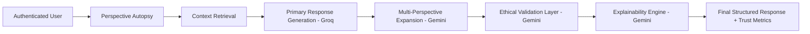

# Intellexa

Ethical, Explainable, and Context-Aware AI Assistant for trust-first decision support.

## Problem Statement
Most chatbots optimize for speed and fluency, but they rarely explain why an answer was generated, what assumptions were made, or whether bias influenced the response.

This creates three core problems:
- Low transparency in high-stakes queries
- Limited personalization and context retention
- Weak safeguards for fairness and ethical reasoning

## Solution Overview
Intellexa is designed as a trust-aware AI system, not just a Q&A bot.

Before answering, Intellexa runs a Perspective Autopsy to inspect user intent, assumptions, and potential bias. It then uses a multi-model pipeline to generate fast responses, reason across multiple perspectives, enforce ethical checks, and provide clear explanations with confidence and trust indicators.

## Why Intellexa Is Different
Unlike conventional chatbots, Intellexa:
- Analyzes the question before generating an answer
- Separates fast generation from deep reasoning using specialized models
- Provides explainability as a default output, not an optional extra
- Applies an ethical validation layer before final delivery
- Tracks trust metrics such as confidence and ethical risk

## Key Features
- Perspective Autopsy: detects assumptions, hidden bias, and missing angles
- Multi-LLM Architecture: Groq for speed, Gemini for reasoning and ethics
- Context Awareness: user-specific memory and history-informed responses
- Explainable AI: includes reasoning trace and rationale with outputs
- Ethical AI Layer: bias detection and fairness-oriented correction
- Trust Metrics: trust score, confidence level, and ethical risk indicator
- Authenticated Experience: Clerk-based user identity and session management

## System Architecture


Architecture notes:
- The pipeline is intentionally staged so each phase has a single responsibility.
- Fast generation and deep reasoning are decoupled for both performance and quality.
- User context is retrieved before generation to produce personalized answers.

## Tech Stack
Frontend:
- React (Vite)
- Clerk Authentication

Backend:
- Node.js (Express)

AI Models:
- Groq (LLaMA) for primary response generation
- Google Gemini for reasoning, ethics, and explainability

Data Layer:
- Supabase / PostgreSQL for user data and memory
- FAISS (optional) for vector search and advanced context retrieval

## How It Works
1. User signs in and submits a query.
2. Intellexa runs Perspective Autopsy on the query.
3. Relevant user context is retrieved from memory/history.
4. Groq generates the primary draft response.
5. Gemini expands the response into multiple ethical perspectives.
6. Ethical layer checks bias and applies fairness corrections.
7. Explainability engine generates rationale and context trace.
8. Final response is returned with trust score, confidence, and risk signals.

Demo links:
- Live URL: [add deployment link](https://intellexa-lac.vercel.app/)

## Installation Guide
Prerequisites:
- Node.js 18+
- npm 9+

Frontend setup:
```bash
cd client
npm install
npm run dev
```

Backend setup (Node.js + Express):
```bash
cd server
npm install
npm run dev
```

Production build (frontend):
```bash
cd client
npm run build
npm run preview
```

## Environment Variables
Frontend (`client/.env`):
```env
VITE_CLERK_PUBLISHABLE_KEY=your_clerk_publishable_key
VITE_API_BASE_URL=http://localhost:8000
```

Backend (`server/.env`):
```env
PORT=8000
NODE_ENV=development
CLERK_SECRET_KEY=your_clerk_secret
GROQ_API_KEY=your_groq_key
GEMINI_API_KEY=your_gemini_key
SUPABASE_URL=your_supabase_url
SUPABASE_SERVICE_ROLE_KEY=your_supabase_service_role_key
DATABASE_URL=your_postgres_connection_string
FAISS_ENABLED=false
```

## Folder Structure
```text
Intellexa/
├─ client/                 # React + Vite frontend
│  ├─ src/
│  ├─ public/
│  └─ package.json
├─ server/                 # Express backend + AI orchestration
│  ├─ src/
│  │  ├─ routes/
│  │  ├─ services/
│  │  ├─ middleware/
│  │  └─ controllers/
│  └─ package.json
├─ README.md
└─ vercel.json
```

## API Overview
Base URL:
- Local: `http://localhost:8000`

Core endpoints:
- `POST /api/v1/auth/session` : validates user session and identity context
- `POST /api/v1/chat` : generates trust-aware response for a user query
- `GET /api/v1/history/:userId` : fetches conversation/context history
- `POST /api/v1/feedback` : stores user feedback for continuous improvement

Example chat request:
```json
{
  "userId": "user_123",
  "query": "Should AI be used in hiring decisions?"
}
```

Example response shape:
```json
{
  "perspective_autopsy": {
    "assumptions": ["..."],
    "bias_detected": "...",
    "missing_angles": ["..."]
  },
  "answer": {
    "utilitarian": "...",
    "rights_based": "...",
    "care_ethics": "..."
  },
  "explanation": ["..."],
  "ethical_check": {
    "bias_detected": true,
    "action_taken": "..."
  },
  "trust_score": 87,
  "confidence": "high"
}
```

## Future Improvements
- Real-time adaptive memory scoring per user intent cluster
- Policy-driven governance controls for regulated domains
- Tenant-level model routing and cost optimization
- Human-in-the-loop review workflows for sensitive outputs
- Evaluation dashboards for factuality, fairness, and consistency

## Contributing
Contributions are welcome.

Suggested flow:
1. Fork the repository
2. Create a feature branch
3. Commit focused changes with clear messages
4. Open a pull request with context and test notes

## License
MIT License.

If you use this project in research or production pilots, please include attribution.
