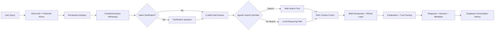

# Intellexa

Trust-aware, explainable AI for real-world decision support.

Intellexa doesn’t just answer questions — it questions the question itself.

## Key Idea
Intellexa is built as an AI reasoning system, not a generic chatbot. It evaluates user intent before answering, detects bias and assumptions, can reframe problematic prompts, decides when external search is needed, and returns answers with transparent reasoning, ethical safeguards, and trust signals.

## Why Intellexa Is Different
- Agentic AI workflow: the model decides when to call search tools, instead of relying on keyword-triggered retrieval.
- Cognitive challenge layer: Perspective Autopsy and Clarification Questions actively challenge ambiguous or biased framing.
- Query Reframing layer: biased or vague prompts can be rewritten into neutral, evidence-seeking queries before generation.
- Ethical + explainable by default: responses include risk-aware handling, trust metrics, and a clear Why this answer explanation.

## Features
### Identity and User Context
- Clerk authentication for secure signup/login and protected routes.
- User-scoped session experience in the frontend.
- Supabase-backed chat history with a ChatGPT-like sidebar.

### Agentic Intelligence and Retrieval
- Full chat interface built with React + Vite.
- Agentic RAG flow where LLaMA can decide when web search is needed.
- Integrated web search for real-time information retrieval.
- Source and citation display in responses.

### Cognitive and Ethical Reasoning
- Perspective Autopsy Engine to detect assumptions, bias, and missing angles.
- Query Reframing (Wow Mode) to conditionally rewrite biased or vague questions.
- Multi-perspective responses across:
  - Utilitarian
  - Rights-based
  - Care ethics
- Ethical AI layer with bias detection, risk categorization, and safe response handling.
- Clarification Question Engine that asks follow-up questions only when needed.

### Trust and Explainability
- Trust score output on a 0 to 100 scale.
- Confidence level labels for answer reliability.
- Explanation Engine with Why this answer transparency.

### Product UX
- ChatGPT-like dashboard layout.
- Sidebar history, smooth scrolling, loading states, and typing effects.
- Reframed Question banner shown above responses when reframing is triggered.
- Stop button to interrupt in-flight generation and typing animation.
- Dedicated analysis and source-aware output views.

## System Architecture
Intellexa uses a staged architecture that combines agentic decisioning with retrieval-aware reasoning.



## How It Works
1. User logs in via Clerk and sends a prompt from the dashboard.
2. Intellexa runs Perspective Autopsy to inspect assumptions, framing, and potential bias.
3. If needed, Intellexa reframes the query into a clearer, neutral, evidence-oriented version.
4. If the query is ambiguous or sensitive, Clarification Question logic can request a follow-up.
5. LLaMA generates a primary answer draft.
6. The system decides agentically whether web search is required.
7. If needed, live web results are retrieved and fused as context.
8. Intellexa generates multi-perspective output and applies the ethical safety layer.
9. Explanation and trust metrics are computed.
10. Final response is returned with sources; when reframing is used, UI shows Reframed Question above the answer.
11. Conversation history is stored in Supabase.

## Tech Stack
- Frontend: React, Vite, Clerk, Axios
- Backend: FastAPI, Uvicorn, Pydantic
- AI Layer: LLaMA via Hugging Face Router, Gemini for reasoning/autopsy/ethics support
- Data Layer: Supabase (conversation storage)
- Optional Retrieval Enhancement: SerpAPI key path with fallback web retrieval strategy

## Installation
### Prerequisites
- Node.js 18+
- Python 3.10+
- npm and pip

### 1) Clone and open project
```bash
git clone https://github.com/SanskarG-20/Intellexa.git
cd Intellexa
```

### 2) Backend setup (FastAPI)
```bash
cd server
python -m venv .venv

# Windows PowerShell
.venv\Scripts\Activate.ps1

# macOS/Linux
# source .venv/bin/activate

pip install -r requirements.txt
python -m app.main
```

Backend starts on http://localhost:8000 and exposes chat at /api/v1/chat.

### 3) Frontend setup (React + Vite)
```bash
cd client
npm install
npm run dev
```

Frontend runs on http://localhost:5173 by default.

## Environment Variables
Create env files in client and server roots.

### Frontend: client/.env
```env
VITE_CLERK_PUBLISHABLE_KEY=your_clerk_publishable_key
VITE_API_BASE_URL=http://localhost:8000/api
# Production example (Vercel -> Railway):
# VITE_API_BASE_URL=https://your-service.up.railway.app/api
VITE_CLERK_TOKEN_TEMPLATE=
VITE_SUPABASE_URL=your_supabase_project_url
VITE_SUPABASE_ANON_KEY=your_supabase_anon_key
```

### Backend: server/.env
```env
APP_NAME=Intellexa Core Chat
DEBUG=true

GEMINI_API_KEY=your_gemini_api_key
GEMINI_MODEL=gemini-2.5-flash
# Testing only: force query reframing for every prompt
FORCE_REFRAME_DEBUG=false

HF_TOKEN=your_huggingface_token
HF_MODEL=meta-llama/Llama-3.1-8B-Instruct

SUPABASE_URL=your_supabase_project_url
SUPABASE_KEY=your_supabase_service_key

SERPAPI_API_KEY=optional_serpapi_key
MOCK_USER_ID=demo_user
```

## Deployment Notes (Vercel + Railway)
- Set Vercel env `VITE_API_BASE_URL` to your Railway backend base URL with `/api` suffix.
- Ensure Railway route `POST /api/v1/chat` is reachable.
- Add your Vercel domain in Railway `CORS_ALLOW_ORIGINS`.
- Redeploy both services after env changes.

## Folder Structure
```text
Intellexa/
|- client/
|  |- src/
|  |  |- components/
|  |  |- pages/
|  |  |- services/
|  |  |- AppRoutes.jsx
|  |  |- main.jsx
|  |- package.json
|- server/
|  |- app/
|  |  |- api/
|  |  |- core/
|  |  |- db/
|  |  |- schemas/
|  |  |- services/
|  |  |- main.py
|  |- requirements.txt
|- README.md
|- vercel.json
```

## Demo
- Live Demo: https://intellexa-lac.vercel.app/

## Future Improvements
- Full Clerk user ID propagation into backend persistence path.
- Streaming token responses for lower perceived latency.
- Automated evaluation suite for bias, factuality, and citation quality.
- Multi-tenant model routing and cost-aware fallback policy.
- Human review workflows for high-risk prompts.
